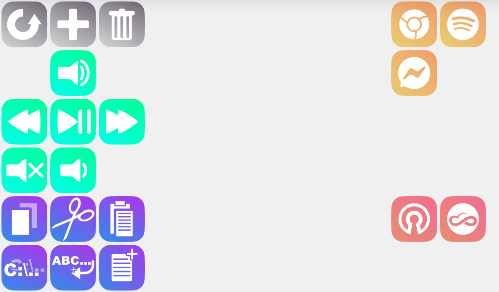

# What is this program?
This program is a simple Python GUI designed to perform similar functions to an Elgato Stream Deck.

In it's current state it is designed to run on a 1024x600 Raspberry pi USB Touchscreen Display, and can run basic terminal commands.

This program was built and tested on Windows, not in any otehr OS, so it may not work correctly in other OS's.

## Current Limitations of the program
Currently, the program doesn;t allow for folders like the Stream deck does, nor does it have any tabs system, or scolling support, so each instance of the program is limited to 60 buttons. It is, however, possible to have multiple copies of the program, by copying the root folder and everything in it.

It also doesn't support different display sizes currently, but more on this in the possible improvements section.

# How to Use

Yet to write up a user manual

## examples of uses

# Possible improvements
Here, I'll be discussing some improvements that could be made to this program. These aren't necessarily things I'll be adding myself, but rather things that can be added fairly simply.
It is possible I'll come back to this project and add these features, but this isn;t a promise as I wish to pursue other projects as well.

I've split this section into 2 further sections:
- Feature improvements
	- Things that can be added to increase the scope of features, and improve overall usability of the program.
- Technical Improvements
	- Things that can be added to optimise the programming behind this project, and make it more complete in general.
## Feature improments
### multiple profiles
It is possible to add a system for creating and utiklizing multiple profiles of teh macro pad, allowing for different macros to be used under different profiles. 
This should be fairly simple to implement, each profile would need it's own Buttons.csv file, and would need it's own instance of the CreateButtons class. 
With that added functionality, a simply drop-down menu could be used to select which profile to open.

### Dynamic screen resizing
It is possible for tkinter to read the current size of the screen being used to display the application, using this information, it should be simple to add a system to read the screen size, divide each dimension by 100 and return how many rows and columns can be created.
Doing this would allow for different screen sizes to be used instead of the specific screen this program was designed for.

### A single button to perform GUI Editing
It should be possible to take the functionality of the refresh, create and delete buttons and move them into their own GUI, thus removing the need for 3 separate buttons for these functions.
Instead a single button can be used to open this GUI, which can then handle the tasks associated with each of these buttons.

### Different button types
It shouldn't be too dificault to add functionality for different types of buttons. At the moment every button created just runs the action provided as a terminal command. 
This mightn't be the best way to perform all functions though, so it could be beneficial to add buttons to perform specific tasks.

## Technical Improvements
### Create a method to see if the Buttons.csv file exists
Currently, the program doesn't check if the Buttons.csv exists, rather it just assumes it does. This could create an issue if something where to happen to that file, as it is what stores the button information.
It should be fairly simple to add a check that the file exists before proceeding with anything else.
This can be expanded to create the file if it doesn't already exist.

### Abstract the create and delete buttons into separate classes
Currently, the create and delete buttons are creating as a method in the main CreateButtons class, all functionality is then added through nested functions.
This limits how customisable and reusable these buttons are in code, and ultimately, isn't best practice.

# Why stop while there's still more to add?
Simply put, it does the job I need it to do, and does so well enough for my needs. Stopping now allows me to prioritize other projects which serves me better in the long run.
As a fresh graduate, I am looking to develop a portfolio, and by hyper-focusing on one single project, I am unable to flesh it out.
This isn't say that I intend to forever leave this project unfinished, but rather to shift priorities, and come back to expand on this project when I have the time and ability.
Taking a break on this project also gives me a chance to use it for a while as intended, and find what features are missing, or bugs I need to fix.
